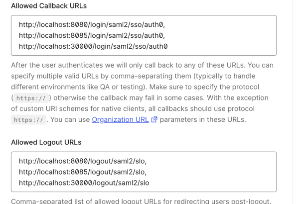
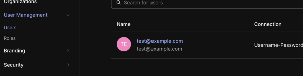

# ui-frontend

Authorization in Spring Boot with Auth0 SAML

## Auth0 Settings

Allowed URLs are like this.  


Use SAML addon.  


Callback URL is like this.   


Added test user.  Password is P@ssw0rd   


## Run
```
./mvnw spring-boot:run
```
Logs are like this.  


Auth screen.  


After Signed in, You can see Principal on home.  
